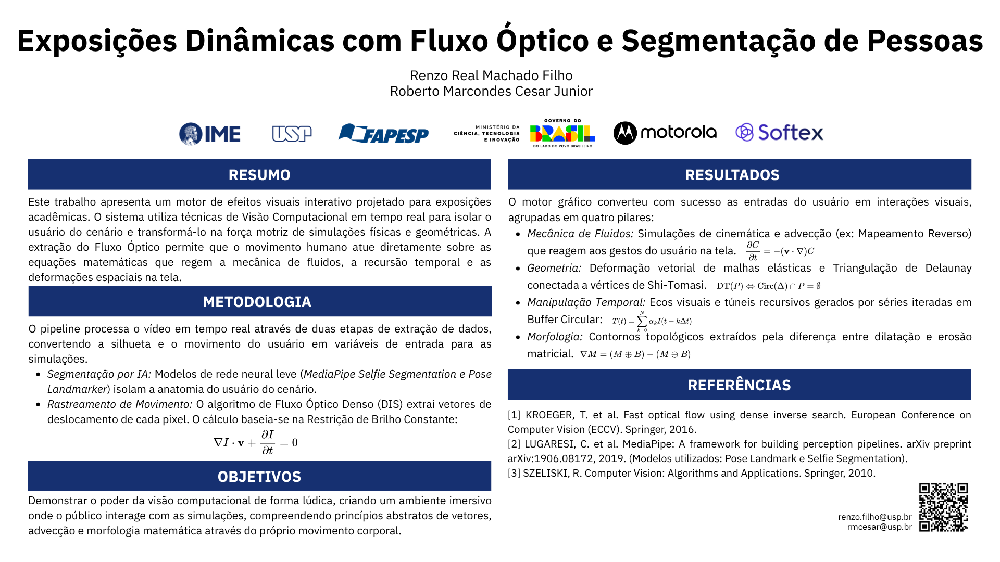

# 👁️‍🗨️ Optical Flow & Background Subtraction: Interactive Exhibition

An advanced, interactive computer vision system designed for public exhibitions, interactive totems, and creative installations. This project merges real-time fluid dynamics, temporal recursion, geometric distortions, and pose-based interactions using state-of-the-art Optical Flow and AI Background Subtraction.

## 📋 Table of Contents

* [Overview](#overview)
* [System Architecture](#system-architecture)
* [Core Technologies](#core-technologies)
* [✨ Visual Effects Gallery](#-visual-effects-gallery)
* [🚀 Quick Start (1-Click Setup)](#-quick-start-1-click-setup)
* [⌨️ Controls](#️-controls)

---

## 🔍 Overview




This application creates a digital mirror that isolates moving users (foreground) from their environment (background) in real-time, applying a dynamic playlist of stunning visual and physics-based effects. 

Built with robustness in mind for long-running public events, it features an automated setup process requiring zero terminal knowledge for staff, a self-contained environment, and a highly optimized processing pipeline that seamlessly coordinates AI segmentation, optical flow, and real-time visual effects.

---

## 🏗 System Architecture

```text
├── assets/                  
│   ├── audio/               
│   ├── icons/               
│   └── models/              
├── prototypes/
│   └── tests/
├── src/                     
│   ├── core/                
│   ├── effects/             
│   ├── utils/               
│   └── main.py              
├── demo.bat                 
├── demo.sh                  
├── setup_win.bat            
├── setup_linux.sh           
├── requirements.txt
└── README.md
````

-----

## ⚙ Core Technologies

The system dynamically hot-swaps between background separation engines depending on the environment lighting and hardware capabilities:

  * **AI Selfie Segmenter (MediaPipe):** Uses a lightweight neural network (`selfie_segmenter_landscape.tflite`) for robust semantic segmentation. Ideal for dynamic, uncontrolled environments.
  * **AI Pose Landmarker (MediaPipe):** Utilizes `pose_landmarker_lite.task` to asynchronously track the user's skeletal structure, driving precise, physics-based hand interactions.
  * **Static Background Subtraction (YCrCb + Otsu):** An ultra-fast, classic computer vision method. Requires capturing an empty room first, perfect for controlled studio lighting.
  * **Optical Flow (DIS Fast):** Calculates precise pixel-by-pixel motion vectors to drive fluid and kinetic particle simulations.

-----

## ✨ Visual Effects Gallery

Thanks to the plugin architecture, each effect inherits from `BaseEffect`, managing its own isolated memory buffers and canvases.

### 🖼️ Overlays & Presentation

| Effect | Description |
| :--- | :--- |
| **Exhibition Slide** | Uses `assets/icons/slide.png` to display a full-screen, static presentation slide. Ideal as an intro/idle screen or a breather between intense visual effects. |
| **Math Chroma Key** | Renders high-quality, scrolling LaTeX formulas that interact with the user's silhouette. |

### ⚛️ Physics & Fluids

| Effect | Description |
| :--- | :--- |
| **Fluid Paint** | Simulates colorful fluid advection injected by the user's movement. |
| **Navier-Stokes** | Advanced fluid dynamics simulation interacting directly with the user's silhouette (Available in *Smooth* and *Reality* variants). |
| **Wave Equation** | Simulates water ripples bouncing off the edges of the screen based on physical impact. |
| **Kinetic Particles** | Thousands of particles driven by the real-time Optical Flow vector field. |

### 🧘 Pose & Anatomy Interaction

| Effect | Description |
| :--- | :--- |
| **Kamehameha** | Tracks the user's hands. Bringing hands together charges energy; thrusting forward fires a directional beam. |
| **Neon Skeleton** | Connects tracked joints with glowing, temporal "light painting" lines. |
| **Flow Bender** | Emits physics-based energy spheres directly from the user's hands. |

### 📐 Geometry & Space

| Effect | Description |
| :--- | :--- |
| **Shattered Glass** | Uses Voronoi diagrams to dynamically shatter the screen, refracting the user's image inside the shards. |
| **Delaunay Constellation**| Builds a living, cybernetic mesh by triangulating the user's silhouette. |
| **Grid Warp** | Deforms a virtual 2D wireframe grid based on physical motion. |

### ⏳ Temporal Recursion

| Effect | Description |
| :--- | :--- |
| **Time / Droste Tunnel** | Maps historical frames into recursive visual depth, shrinking the user into an infinite tunnel. |

### 🎨 Artistic Filters

Includes real-time processing aesthetics: **Cyber Glitch**, **Cartoon**, **Neon Silhouette**, **Heatmap**, and **Negative**.

-----

## 🚀 Quick Start (1-Click Setup)

Built for fast deployment at live events. No terminal commands required for the end-user.

**Prerequisite:** Ensure **Python 3.8+** is installed on the target machine.

1.  **Transfer:** Copy the project folder to the target machine.
2.  **Auto-Configuration:** Run the setup script for your OS to automatically map paths and generate a Desktop shortcut.
      * **Windows:** Double-click `setup_win.bat`
      * **Linux:** Run `setup_linux.sh` (ensure it has executable permissions).
3.  **Run the Exhibition:** Go to your Desktop and double-click the **"Demo Visão Computacional"** shortcut.
      * *Note: The first launch will automatically create a virtual environment and download necessary libraries (OpenCV, MediaPipe, etc.). Subsequent launches will be instant.*

-----

## ⌨️ Controls

The application is controlled via keyboard, designed to be operated discreetly by event staff:

| Key | Action |
| :---: | :--- |
| `n` | **Next Effect:** Cycle forward through the visual styles playlist. |
| `l` | **Last Effect:** Go back to the previous effect. |
| `m` | **Toggle Mode:** Switch between AI Selfie Segmenter, AI Pose Segmenter, and Static Background Subtraction. |
| `b` | **Capture Background:** Capture a new static room model (Only works in Static Mode. Step out of the frame first\!). |
| `r` | **Reset:** Clears the internal memory/canvas of the current effect (e.g., shatters the glass again). |
| `d` | **Toggle HUD:** Show/Hide on-screen debug and status information. |
| `q` / `Esc` | **Quit:** Safely close the application and release the camera. |

-----

## 📄 License

This project is licensed under the MIT License - see the [LICENSE](https://www.google.com/search?q=LICENSE) file for details.